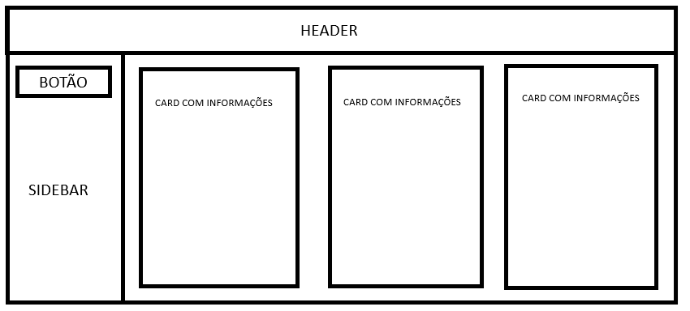

# Documentação do Projeto: Amigos de Orleans

## Visão Geral

O projeto "Amigos de Orleans" é uma aplicação web que apresenta três amigos com suas respectivas biografias. A interface permite que os usuários embaralhem a ordem dos cartões dos amigos, proporcionando uma interação divertida e dinâmica.

## Estrutura do Projeto

### Arquivos

- `index.html`: Contém a estrutura HTML da página.
- `style.css`: Define o estilo visual da aplicação.
- Imagens: `rafael.jpeg`, `joao.jpeg`, `kaike.jpeg`.

## Funcionalidades

1. **Exibição de Amigos**: Cada amigo possui um cartão que contém uma imagem e uma descrição.
2. **Embaralhar Cartões**: Um botão permite ao usuário embaralhar a ordem dos cartões dos amigos.
3. **Sobreposição**: Ao passar o mouse sobre um cartão, uma sobreposição aparece com mais informações sobre o amigo.

## Tecnologias Utilizadas

- CSS3: Para estilização e layout responsivo.
- JavaScript: Para manipulação do DOM e interatividade.

## Detalhes de Implementação

### HTML

A estrutura HTML é organizada em três seções principais:

- **Header**: Contém o título da aplicação.
- **Aside**: Contém o botão de embaralhamento.
- **Main**: Exibe os cartões dos amigos.

### CSS

O estilo é gerido através de um sistema de grid para garantir um layout responsivo. Estilos são aplicados para:

- **Cores e fontes**: Definem a paleta de cores e a tipografia.
- **Cartões**: Definem a aparência dos cartões e as transições de opacidade para as sobreposições.
  
### JavaScript

Um script simples manipula a ordem dos cartões:

- **Função `shuffleCards`**: Embaralha os cartões aleatoriamente ao clicar no botão.

## Instruções para Execução

1. **Pré-requisitos**: Certifique-se de ter um navegador moderno instalado.
2. **Estrutura de Pastas**: Coloque os arquivos `index.html`, `style.css` e as imagens na mesma pasta.
3. **Abrir a Aplicação**: Abra o arquivo `index.html` em um navegador para visualizar a aplicação.

## Layout
